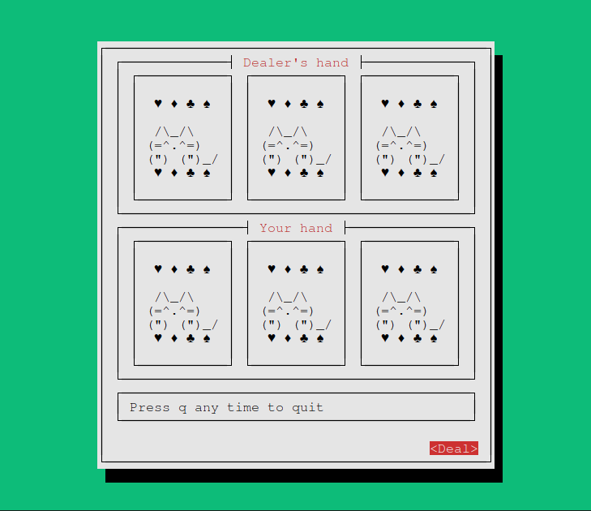
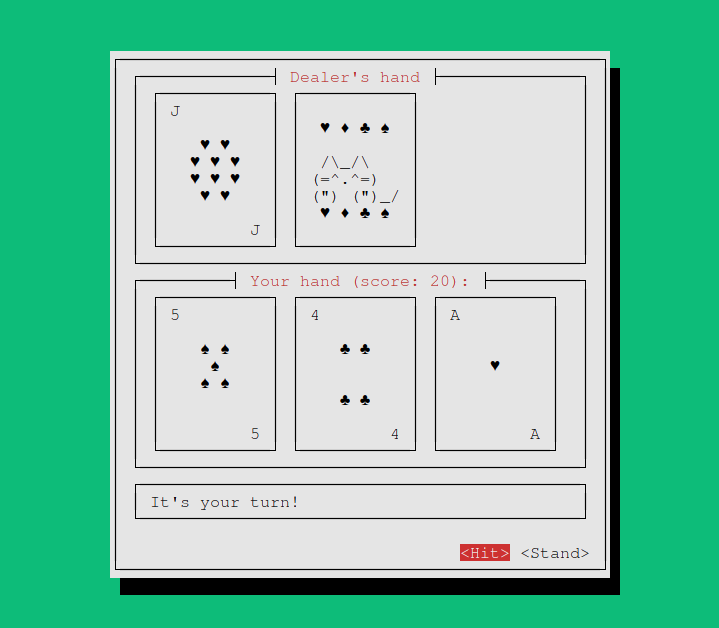
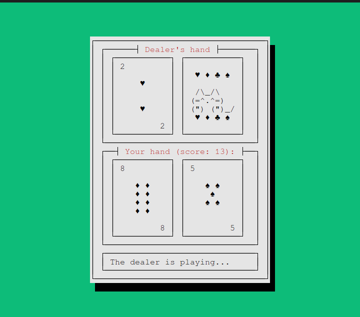
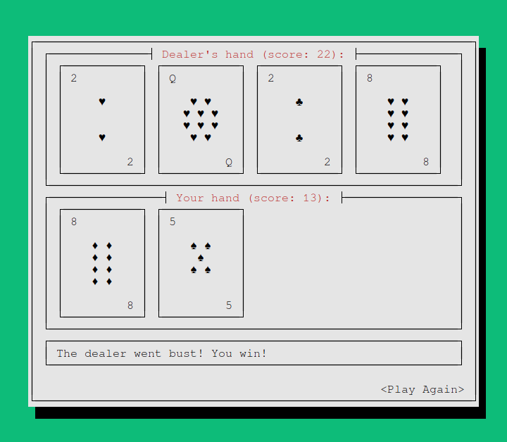

# Blackjack

A Rust implementation of a single-player Blackjack game.

Can be played as either a TUI (Terminal User Interface) or a CLI (Command Line Interface).

To play, install [the Rust toolchain](https://rustup.rs) and run `cargo run` in a terminal.

To play CLI mode, use the `-c` flag (`cargo run -- -c`).

If the UTF-8 characters cause issues, use `-a` to display only ASCII characters (`cargo run -- -a`).

# Screenshots

## Starting a game

## Your Turn

## The Dealer's turn

## Game Over

